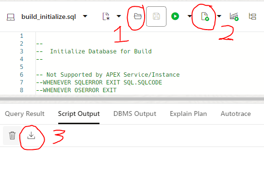

# APEX Service/Instance

[Oracle.com Website](https://www.oracle.com/application-development/apex/)

This folder includes ODBCapture installation scripts for Oracle's APEX Service/Instance on OCI.

## File/Folder List

File Name                    | Description
-----------------------------|-------------
OCI_APEX_convall.sh          | Bash Script to Convert all Source Code Folders
OCI_APEX_conversion.sh*      | Bash Script to Convert one Source Code Folder
OCI_APEX_install_grbdat.sql  | Converted Source Code Script for APEX OCI
OCI_APEX_install_grbjava.sql | Converted Source Code Script for APEX OCI
OCI_APEX_install_grbras.sql  | Converted Source Code Script for APEX OCI
OCI_APEX_install_grbsdo.sql  | Converted Source Code Script for APEX OCI
OCI_APEX_install_grbsrc.sql  | Converted Source Code Script for APEX OCI
OCI_APEX_install_grbtctx.sql | Converted Source Code Script for APEX OCI
OCI_APEX_install_grbtdat.sql | Converted Source Code Script for APEX OCI
OCI_APEX_install_grbtjsn.sql | Converted Source Code Script for APEX OCI
OCI_APEX_install_grbtjva.sql | Converted Source Code Script for APEX OCI
OCI_APEX_install_grbtsdo.sql | Converted Source Code Script for APEX OCI
OCI_APEX_install_grbtst.sql  | Converted Source Code Script for APEX OCI

## Installation

### Login
1. Go to [Oracle MyCloud](https://myservices-ddieterich.console.oraclecloud.com/mycloud/cloudportal/gettingStarted)
2. Set Tenancy to `DDieterich`
3. Set Identity Domain to `OracleIdentityCloudService`
4. Enter `User Name` and `Password`
5. Enter `Passcode` from Google Authentication
6. Go to `APEX Instances`
7. Click on `APEX01`
8. Click on `Launch Database Actions`
9. Under the `Development` tab, click on `SQL`

### Run build_intiailize.sql
1. Open `build_initialize.sql`
2. Click on `Run script`
3. Click on `Download Script Output`
4. Save to file `build_initialize.sql`

