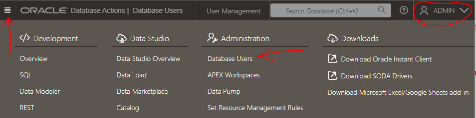
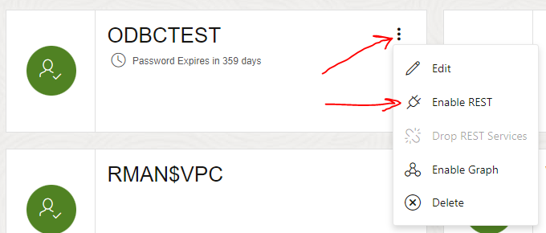
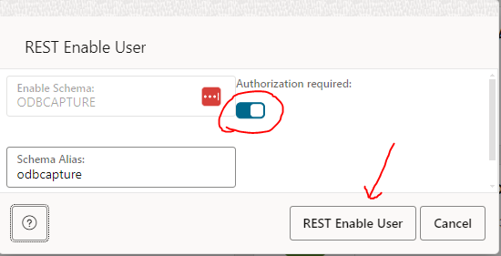
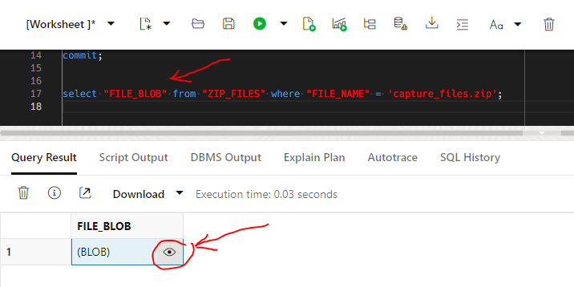

# APEX Service/Instance

[Oracle.com Website](https://www.oracle.com/application-development/apex/)

This folder includes ODBCapture installation scripts for Oracle's APEX Service/Instance on OCI.


## File/Folder List

File Name               | Description
------------------------|-------------
*.PNG                   | Screen shots for documentation
OCI_APEX_conversion.sh  | Bash Script to Convert one Source Code Folder
OCI_APEX_install.sql    | Converted Source Code Script


## Installation

### Run OCI_APEX_conversion.sh
1. Run BASH
2. "cd" to this folder
3. ./OCI_APEX_conversion.sh
4. Review/Modify `OCI_APEX_install.sql`:
    * Translating ../grbtst/ODBCAPTURE/GRBTST__NAME.csv
    * Translating ../grbtst/ODBCAPTURE/GRBTST_IMAGE.csv
    * Translating ../grbtjsn/ODBCAPTURE/GRBTST_JSON.csv
    * Translating ../grbtsdo/ODBCTEST/SDO_COLA_MARKETS.csv

### Login to APX01 Database Actions on Oracle Cloud
1. Go to [Oracle MyCloud](https://myservices-ddieterich.console.oraclecloud.com/mycloud/cloudportal/gettingStarted)
2. Set Tenancy to `DDieterich`
3. Set Identity Domain to `OracleIdentityCloudService`
4. Enter `User Name` and `Password`
5. Enter `Passcode` from Google Authentication
6. Go to `APEX Instances`
7. Click on `APX01`
8. Click on `Launch Database Actions`
9. Login as "ADMIN"
10. Under the `Development` tab, click on `SQL`

### Initialize APX01
1. Open `../builds/OCI_APEX235/build_initialize.sql`
2. Click on `Run script`
3. Click on `Download Script Output`
4. Save to file `../builds/OCI_APEX235/build_initialize.txt`
5. Review `../builds/OCI_APEX235/build_initialize.txt`


### Installation
1. Open `OCI_APEX_install.sql`
2. Click on `Run script`
3. Click on `Download Script Output`
4. Save to file `../builds/OCI_APEX235/OCI_APEX_install.txt`
5. Review `../builds/OCI_APEX235/OCI_APEX_install.txt`
6. Manually Run Final Processing as "ADMIN"
    * alter user "ODBCAPTURE" identified by "PASSWORD1";
    * alter user "ODBCTEST" identified by "PASSWORD2";
    * ../grb_linked_install_scripts/fix_invalid_public_synonyms.sql
    * ../grb_linked_install_scripts/compile_all.sql
    * ../grb_linked_install_scripts/alter_foreign_keys.sql ENABLE
    * ../grb_linked_install_scripts/alter_triggers.sql ENABLE
    * ../grb_linked_install_scripts/update_id_sequences.sql

### REST Enable "ODBCAPTURE" and "ODBCTEST"
1. Navigate to Database Users Page
    
    

2. Select a User to Rest Enable
    
    

3. Rest Enable User
    
    
    

### Manually Run Final Processing
1. Open SQL Worksheet as "ODBCAPTURE"
2. Open and Run Final Processing
    * ../grbtst/RAS_Admin_ODBCTEST.racl
3. Open SQL Worksheet as "ODBCTEST"
4. Manually Run Final Processing
    * ../grbtsdo/COLA_SPATIAL_IDX.tidx

### Example DB Capture After Installation
1. Run these in an SQL Worksheet as "ODBCAPTURE"
    ```
    execute FH2.clear_buffers;
    execute COMMON_UTIL.update_view_tabs;
    execute GRAB_SCRIPTS.all_scripts('grbsrc');
    execute GRAB_SCRIPTS.all_scripts('grbras');
    execute GRAB_SCRIPTS.all_scripts('grbsdo');
    execute GRAB_SCRIPTS.all_scripts('grbdat');
    execute GRAB_SCRIPTS.all_scripts('grbtst');
    execute GRAB_SCRIPTS.all_scripts('grbtjsn');
    execute GRAB_SCRIPTS.all_scripts('grbtsdo');
    execute GRAB_SCRIPTS.all_scripts('grbtctx');
    execute GRAB_SCRIPTS.all_scripts('grbtdat');
    delete from zip_files where file_name = 'capture_files.zip';
    execute FH2.write_scripts('capture_files.zip');
    commit;
    ```
2. Click on `Download Script Output`
    * Save to file `Grab_Scripts_Output.txt`
3. Run the Query
    * `Select "FILE_BLOB" from "ZIP_FILES" where "FILE_NAME" = 'capture_files.zip';`
4. Select the BLOB from the Query Results
    
    

5. Download data from "FILE_BLOB" to "capture_files.zip"
    
    

6. Run `./compare_zip.sh capture_files` using BASH

### Notes

```
The only configuration commands that persist during a session in Database Actions are:

SET DEF[INE] <ON|OFF|prefix_character>
SET ESC[APE] <ON|OFF|escape_character>
SET TIMI[NG] <ON|OFF>
```

&nbsp;&nbsp;&nbsp;&nbsp;&nbsp;&nbsp;&nbsp;&nbsp;&nbsp;&nbsp;&nbsp;&nbsp;&nbsp;&nbsp;&nbsp;[Ref: Using Guide for Oracle Cloud](https://docs.oracle.com/en/database/oracle/sql-developer-web/sdwad/sql-page.html#GUID-3B651F54-DE41-42BD-B643-19741A25213A)