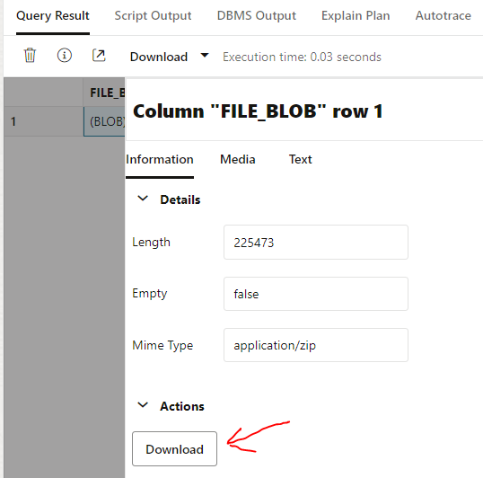

# APEX Service/Instance

[Oracle.com Website](https://www.oracle.com/application-development/apex/)

This folder includes ODBCapture installation scripts for Oracle's APEX Service/Instance on OCI.


## File/Folder List

File Name                   | Description
----------------------------|-------------
*.PNG                       | Screen shots for documentation
compare_zip.sh              | Unzip/Compare output from "run_grab_scripts.sql"
OCI_APEX_conversion.sh      | Bash Script to Convert one Source Code Folder
OCI_APEX_install.sql        | Converted Source Code Script
run_grab_scripts.sql        | Captured DB Source Code for Testing/Confirmation
set_user_authentication.sql | Creates passwords for New Schema


## Installation

This example uses the "../builds/OCI_APEX235/" folder.

### Run OCI_APEX_conversion.sh
1. Run BASH
2. "cd" to this folder
3. ./OCI_APEX_conversion.sh
4. Fix errant INSERT statements in `OCI_APEX_install.sql` at these locations:
    * Translating ../grbtst/ODBCAPTURE/GRBTST__NAME.csv
    * Translating ../grbtst/ODBCAPTURE/GRBTST_IMAGE.csv
    * Translating ../grbtjsn/ODBCAPTURE/GRBTST_JSON.csv
    * Translating ../grbtsdo/ODBCTEST/SDO_COLA_MARKETS.csv

### Login to APX01 Database Actions on Oracle Cloud
1. Go to [Oracle MyCloud](https://myservices-ddieterich.console.oraclecloud.com/mycloud/cloudportal/gettingStarted)
2. Set Tenancy to `DDieterich`
3. Set Identity Domain to `OracleIdentityCloudService`
4. Enter `User Name` and `Password`
5. Enter `Passcode` from Google Authentication
6. Go to `APEX Instances`
7. Click on `APX01`
8. Click on `Launch Database Actions`
9. Login as "ADMIN"
10. Under the `Development` tab, click on `SQL`

### Initialize APX01
1. Open `../builds/OCI_APEX235/build_initialize.sql`
2. Click on `Run script`
3. Click on `Download Script Output`
4. Save to file `../builds/OCI_APEX235/build_initialize.txt`
5. Review `../builds/OCI_APEX235/build_initialize.txt`
    * REGEXP Search: `(ORA-|SQL-|SP2-|PLS-|PL2-|TNS-|(object|mmap) failed|WARNING: Prerequisite BUILD_TYPE)`


### Installation
1. Open `OCI_APEX_install.sql`
2. Click on `Run script`
3. Click on `Download Script Output`
4. Save to file `../builds/OCI_APEX235/OCI_APEX_install.txt`
5. Review `../builds/OCI_APEX235/OCI_APEX_install.txt`
    * REGEXP Search: `(ORA-|SQL-|SP2-|PLS-|PL2-|TNS-|(object|mmap) failed|WARNING: Prerequisite BUILD_TYPE)`

### Set User Authentication
1. Open and Run `set_user_authentication.sql` as "ADMIN"
2. Save Script Output to file `../builds/OCI_APEX235/set_user_authentication.txt`

### REST Enable "ODBCAPTURE" and "ODBCTEST"
1. Navigate to Database Users Page
    
    

2. Select a User to Rest Enable
    
    

3. Rest Enable User
    
    
    

### Manually Run Final Processing
1. On the "Database Users Page" as "ADMIN"
2. Find the "ODBCTEST" card
3. Click on "Open New Tab" at the Bottom Right
4. Login as "ODBCTEST"
5. Open SQL Worksheet
6. Manually Run Final Processing
    * ../grbtst/RAS_Admin_ODBCTEST.racl
    * ../grbtsdo/COLA_SPATIAL_IDX.tidx

### Example DB Capture After Installation
1. On the "Database Users Page" as "ADMIN"
2. Find the "ODBCAPTURE" card
3. Click on "Open New Tab" at the Bottom Right
4. Login as "ODBCAPTURE"
5. Open SQL Worksheet
6. Open and Run `../../apex/run_grab_scripts.sql`
7. Click on `Download Script Output`
    * Save to file `../builds/OCI_APEX235/run_grab_scripts.txt`
8. Run the Query
    * `select "FILE_BLOB" from "ZIP_FILES" where "FILE_NAME" = 'capture_files.zip';`
9.  Select the BLOB from the Query Results
    
    

10. Download data from "FILE_BLOB" to `../builds/OCI_APEX235/capture_files.zip`
    
    

11. Go to BASH
12. `cd ../builds/OCI_APEX236/`
13. Run `../../apex/compare_zip.sh capture_files`
14. Review `diff_report.txt`

## Notes

```
The only configuration commands that persist during a session in Database Actions are:

SET DEF[INE] <ON|OFF|prefix_character>
SET ESC[APE] <ON|OFF|escape_character>
SET TIMI[NG] <ON|OFF>
```

&nbsp;&nbsp;&nbsp;&nbsp;&nbsp;&nbsp;&nbsp;&nbsp;&nbsp;&nbsp;&nbsp;&nbsp;&nbsp;&nbsp;&nbsp;[Ref: Using Guide for Oracle Cloud](https://docs.oracle.com/en/database/oracle/sql-developer-web/sdwad/sql-page.html#GUID-3B651F54-DE41-42BD-B643-19741A25213A)